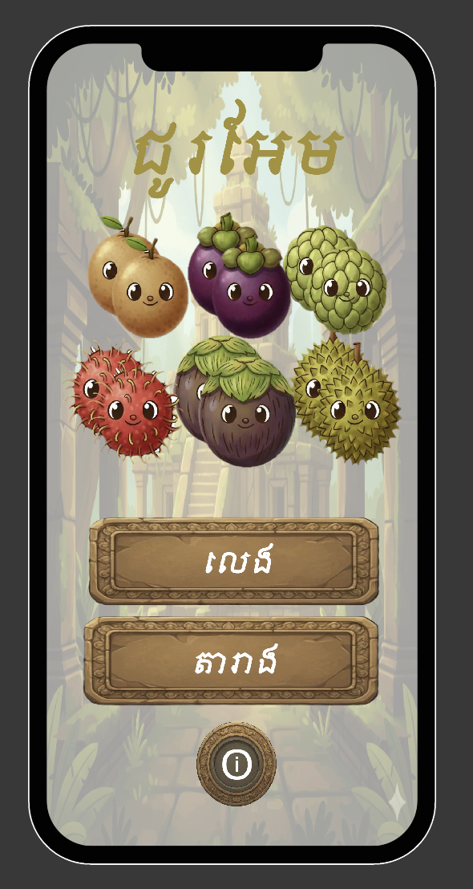
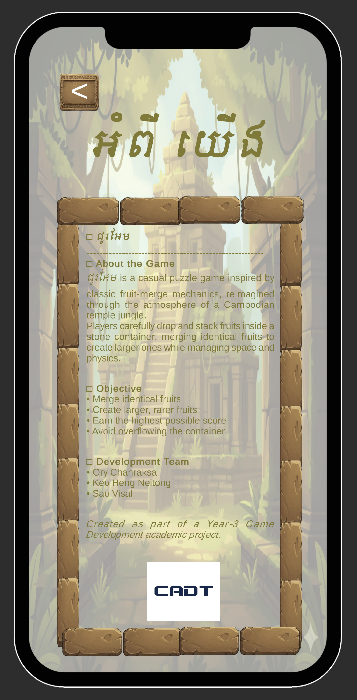
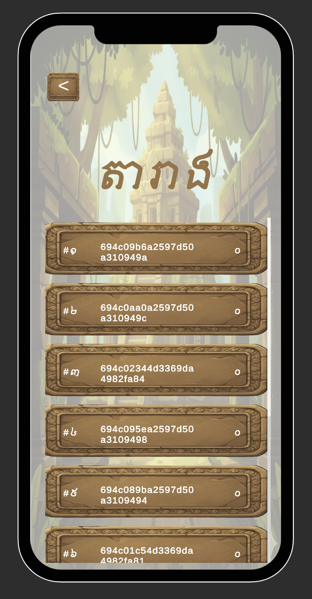
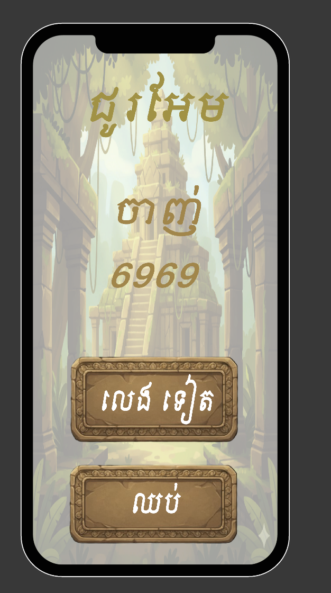

# ជូរអែម (Jou Em) - Backend API 🍎🏛️

Backend API for the captivating Cambodian fruit merging puzzle game **ជូរអែម**, featuring traditional Khmer fruits in an ancient temple setting. This Express.js server manages game sessions, scores, and leaderboards for the mystical temple jungle adventure.

## 🎮 Game Overview

**ជូរអែម** is an engaging fruit merging puzzle game that reimagines classic fruit merge mechanics within the mystical atmosphere of Cambodian temple jungles. This backend API powers the game's session management and scoring system.

### Key Features

- 🇰🇭 **Fully Khmer Experience**: Complete Khmer language interface with traditional Khmer numerals
- 🍎 **6 Fruit Levels**: Progress through មៀន → សាវម៉ាវ → មង្ឃុត → ទៀប → ត្នោត → ធុរេន
- 🏛️ **Temple Jungle Theme**: Beautiful Cambodian-inspired backgrounds and atmosphere
- 📱 **Mobile Optimized**: Responsive design for all devices
- ⚡ **Physics-Based**: Realistic fruit physics and collision mechanics
- 🏆 **Global Leaderboards**: Track high scores across all players

## 📱 Game Screenshots

<div align="center">


_Main menu showcasing all 6 traditional Cambodian fruits with temple jungle backdrop_


_Active gameplay with fruit dropping mechanics and temple stone container_


_Game information screen with development team credits and CADT branding_


_Global leaderboard showing top players with session IDs_


_Game start screen with traditional Khmer interface elements_

</div>

## 🎯 How to Play

Merge identical fruits to evolve them into higher-level fruits and earn points:

- **មៀន + មៀន = សាវម៉ាវ** (+20 points)
- **សាវម៉ាវ + សាវម៉ាវ = មង្ឃុត** (+40 points)
- **មង្ឃុត + មង្ឃុត = ទៀប** (+80 points)
- **ទៀប + ទៀប = ត្នោត** (+160 points)
- **ត្នោត + ត្នោត = ធុរេន** (+320 points)

**Goal**: Achieve the highest score by strategic fruit placement and merging!

## 🚀 Quick Start

### Requirements

- Node.js (recommended: latest LTS)
- MongoDB (local or hosted)

### Setup

1. **Install dependencies:**

```bash
npm install
```

2. **Create a `.env` file in the project root:**

```bash
PORT=3000
MONGODB_URI="mongodb://127.0.0.1:27017/fruit-merge"
```

### Run the Server

- **Development (auto-restart):**

```bash
npm run dev
```

- **Production:**

```bash
npm start
```

The server listens on `http://localhost:$PORT`.

## 📊 Data Model

- **Collection**: `gameSession`
- **Document fields**:
  - `date` (Date): last updated time for the session
  - `score` (number): session score
  - `_id` (ObjectId): used as `gameSessionId`

## 🔌 API Endpoints

Base path: `/game`

### Create a Game Session

**POST** `/game`

Response:
```json
{ "gameSessionId": "..." }
```

### Update Session Score

**PUT** `/game/:sessionId/score`

Body:
```json
{ "score": 123 }
```

Response: MongoDB update result.

### Global All-Time Leaderboard (Top 10)

**GET** `/game/all-time`

Response: List of sessions with `_id` and `score`, sorted by score desc.

## 🛠️ Tech Stack

- **Backend**: Express.js + TypeScript
- **Database**: MongoDB with Mongoose
- **Game Engine**: Unity 2022.3
- **Frontend**: HTML5, CSS3, JavaScript

## 📂 Project Structure

```
src/
├── app.ts                     # Express app + route mounting + MongoDB connect
├── routes/
│   └── game.route.ts         # Game endpoints
├── controllers/
│   └── game.controller.ts    # Handlers (create session, update score, leaderboard)
└── mongoose/
    ├── mongoose.ts           # MongoDB connection helper
    └── game_session.model.ts # GameSession schema/model
```

## 🌐 Related Repositories

This project is part of a comprehensive game development ecosystem:

| Repository | Description | Link |
|------------|-------------|------|
| 🎮 **Game Client** | Unity game source code | [Fruit-Merge-Game](https://github.com/Neitong/Fruit-Merge-Game.git) |
| 🖥️ **Backend API** | Express.js server & database | [fruit-merge-backend](https://github.com/salxz696969/fruit-merge-backend) |
| 🌐 **Website** | Marketing website & web version | [fruit-merge-website](https://github.com/RaksaOC/fruit-merge-website.git) |

### 🌐 Live Links

- **🎮 Play Online**: [https://raksaoc.github.io/fruit-merge-website/](https://raksaoc.github.io/fruit-merge-website/)
- **📱 Download APK**: Available on the website above

## 👥 Development Team

**Created as part of 3rd Year Game Development Program at CADT University**

- **អោយ ច័ន្ទរក្សា** (Ory Chanreaksa) - [@RaksaOC](https://github.com/RaksaOC)
- **កែវ ហេងណៃតុង** (Keo Hengneitong) - [@Neitong](https://github.com/Neitong)
- **សៅ វិសាល** (Sao Visal) - [@salxz696969](https://github.com/salxz696969)

## 🎨 Cultural Inspiration

This game celebrates Cambodian culture through:

- **Traditional Khmer Fruits**: Native fruits like រំបុត (rambutan), មង្ឃុត (mangosteen), ធុរេន (durian)
- **Ancient Temple Architecture**: Inspired by Angkor Wat and jungle temple aesthetics
- **Complete Khmer Localization**: Full game interface in Khmer language
- **Traditional Khmer Numerals**: Authentic cultural number system integration

## 📝 Notes

- `gameSessionId` is the MongoDB `_id` generated when you create a session
- All scores are stored with timestamps for leaderboard ranking
- The API supports real-time score updates during gameplay
- Session management allows for pause/resume functionality

---

<div align="center">

**Experience the mystical world of Cambodian temple jungles while enjoying classic puzzle gameplay!**

[🌐 Visit Website](https://raksaoc.github.io/fruit-merge-website/) | [🎮 Play Online](https://raksaoc.github.io/fruit-merge-website/) | [📱 Download APK](https://raksaoc.github.io/fruit-merge-website/)

*Built with ❤️ in Cambodia 🇰🇭*

</div>